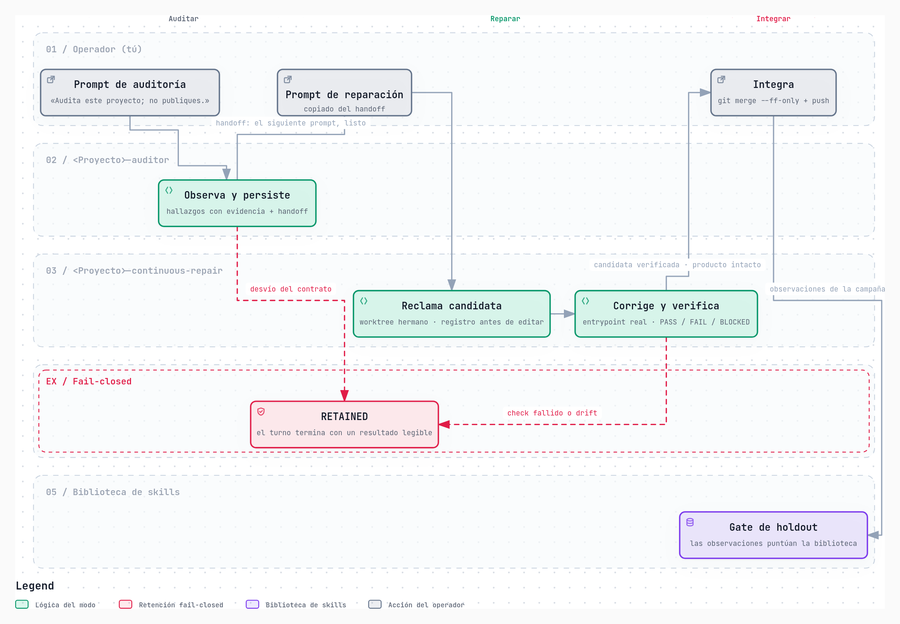
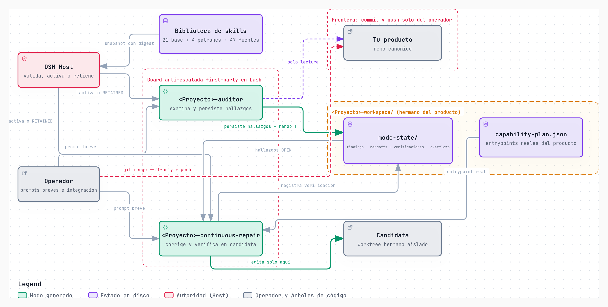

# Improvement

[English](README.md) | **Español**

[](LICENSE) [](docs/plans/10-lanzamiento-publico.md) [](https://github.com/MadManJohnSmith/Improvement/actions/workflows/ci.yml) [](https://github.com/MadManJohnSmith/Improvement/releases)

**Un auditor y un reparador que viven junto a tu repositorio: encuentran los defectos
reales, los arreglan verificándolo con tus propias pruebas y dejan el commit y el push en
tus manos.**

Si mantienes un proyecto vivo, esto te suena: la misma clase de bug vuelve cada pocas
semanas, auditar a fondo se queda siempre para mañana y el porqué de cada arreglo vive en
la cabeza de quien lo hizo. Improvement convierte esa rutina en un ciclo con memoria: le
hablas con prompts de una línea, el framework hace el trabajo pesado y tú decides qué se
integra.

Al instalarlo, genera **dos modos hechos a la medida de tu proyecto**. El **auditor**
examina el código y registra cada hallazgo con su evidencia (`archivo:línea`) y su
severidad. El **reparador** corrige en un worktree aislado, verifica cada arreglo contra
los comandos reales de tu proyecto y deja tu árbol intacto. Nada llega a tu rama sin pasar
por ti.

Es un framework probado en tres campañas completas sobre repositorios reales: Syncify
(una app de música en Rust/Tauri/Vue), RehabWeb (una app clínica en Django/Vue) y LoboApp
(una app Flutter, con el framework instalado desde un clon de GitHub). Las métricas de
abajo son de esas campañas, no promesas.

## Inicio rápido

### ¿Qué es DSH?

Improvement no trae su propia IA: trabaja sobre **DSH (DeepSeek Harness)**, el runtime de
agentes open source de DeepSeek (licencia MIT, más de 240.000 estrellas en GitHub). Su
arquitectura es *everything is a plugin*: modelos, herramientas, skills, sesiones y
sandbox se componen como plugins. Corre en tu máquina y abre una web local en el
navegador (`npx @deepseek-ai/dsh web`); su
[documentación](https://deepseek-harness.github.io/deepseek-harness/) cuenta el resto.
Está en *developer preview* y itera rápido.

Improvement instala en DSH los dos modos generados para tu proyecto, como presets de
agente: es la aplicación donde hablas con ellos. Tus credenciales de proveedor viven en
DSH; Improvement nunca las lee ni las pide, solo comprueba que el proveedor que
configuraste existe.

### Requisitos

Linux, `git` y Python 3, y [DSH](docs/setup-dsh.md) ya configurado con al menos un
proveedor/modelo tuyo. Nada más.

Clona el framework **junto a tu proyecto, nunca dentro**, y ejecuta un comando:

```bash
git clone https://github.com/MadManJohnSmith/Improvement.git
cd Improvement
python3 -B scripts/bootstrap.py install \
  --project /ruta/a/tu/proyecto \
  --launch-dsh
```

Eso descubre tu proyecto, genera `<TuProyecto>-auditor` y `<TuProyecto>-continuous-repair`
con sus skills, valida el paquete en 10 capas, hace backup, instala y activa; si algo
falla, hace rollback dejando el estado recuperable. Tu producto no se toca durante la
instalación.

## El problema que resuelve

En proyectos de larga vida, la auditoría y la reparación se vuelven difíciles por tres
motivos: el contexto se llena, los errores vuelven a ocurrir porque nadie recuerda el
anterior, y cada arreglo se hace con criterio distinto. Improvement pone eso en una
estructura que sobrevive a los ciclos:

- un **auditor** que examina tu proyecto y persiste hallazgos con evidencia
  (`archivo:línea`), severidad y deduplicación por `(hallazgo, revisión)`;
- un **reparador** que toma los hallazgos, reclama una candidata de trabajo aislada en un
  worktree hermano, la corrige, verifica y **te deja el árbol de tu producto intacto**;
- una **memoria en disco** (`<proyecto>-workspace/mode-state`) con topes estrictos por
  fichero y por registro: crece hasta su límite y se compacta, no se satura;
- una **frontera de integración clara**: el modo deja el candidato verificado y tú haces
  el commit y el push. Nada llega a tu rama sin pasar por ti.

## De dónde salen los modos

Los dos modos no salen de una plantilla vacía: se componen en cada instalación desde una
**biblioteca de skills** con procedencia registrada. La base son 21 skills inmutables —
desarrollo dirigido por tests, depuración sistemática, endurecimiento de seguridad,
revisión de código, escritura de planes…— reimplementadas con atribución MIT. Encima, 4
patrones especializados que solo se activan ante señales observadas en tu proyecto:
revisión estática de políticas IAM, verificación de cabeceras HTTP de seguridad, contrato
OpenAPI de FastAPI y accesibilidad WCAG 2.2. Detrás hay 47 fuentes externas fijadas —
repositorios, estándares W3C, guías de AWS y MDN — con URL, revisión y licencia
registradas de cada una.

Creator selecciona siguiendo un orden obligatorio: primero una skill base; luego un
patrón del catálogo, solo si su señal aparece de verdad en tu repo; después
composiciones; y solo al final una extensión nueva, que exige demostrar que lo anterior
no aplica. Cada reutilización se declara y el Host la verifica contra el snapshot de la
biblioteca congelado con su digest al instalar: lo que tu modo reutiliza es exactamente
lo que el digest firmó, no una versión deslizada después. Es el flujo que generó los
modos de RehabWeb, LoboApp y del propio framework.

**La biblioteca mejora con evidencia, no con opiniones.** Sus 55 escenarios se compilan
en casos ejecutables cuyo veredicto esperado solo conoce el Host. Ningún cambio de una
skill base entra sin puntuar en un gate que únicamente acepta mejora estricta: los
intentos rechazados quedan con su score antes/después y la razón del rechazo alimenta el
siguiente intento, para que el framework no pague dos veces la misma corrección. El
ejecutor es `bootstrap.py skill-gate-run`: contra una sesión DSH con tu proyecto, el
bucle completo queda en tus manos — usas los modos, produces observaciones, el gate
puntúa, la biblioteca solo puede mejorar.

## Cómo se usa

### Prompts simples

Con los dos presets activos en DSH, operas con mensajes cortos:

| Quieres… | Escribes |
|---|---|
| Auditar todo | «Audita completamente este proyecto; no modifiques ni publiques.» |
| Auditar un área | «Audita este flujo, característica o componente.» |
| Reparar lo auditado | «Repara los hallazgos de la auditoría; no publiques.» |
| Reparar hallazgos concretos | «Repara A-SEC-01 y A-SEC-02; no publiques.» |

Cada auditoría deja un handoff con el siguiente prompt listo para copiar. Cuando el
reparador termina, integras con un `git merge --ff-only` normal: el commit y el push
siguen siendo tuyos.



*El ciclo completo, incluido el cierre del aprendizaje: las observaciones de cada campaña
puntúan la biblioteca en el gate de holdout. Es un diagrama explorable: cada relación se
puede trazar y el tema cambia claro/oscuro en la [versión interactiva](https://madmanjohnsmith.github.io/Improvement/diagrams/ciclo-operativo.html).*

## Los términos que verás

| Término | Qué es |
|---|---|
| DSH (DeepSeek Harness) | El runtime de agentes open source de DeepSeek, donde viven los dos modos y tus credenciales de proveedor. |
| Modo | Cada uno de los dos agentes generados para tu proyecto: el auditor y el reparador. |
| Hallazgo | Un defecto registrado con evidencia (`archivo:línea`), severidad, causa y prevención. |
| Handoff | El registro que deja cada auditoría, con el siguiente prompt listo para copiar. |
| Candidata | El worktree hermano y aislado donde el reparador cambia código. |
| `mode-state` | La memoria en disco del workspace: hallazgos, handoffs, verificaciones y recibos. |
| Plan de capacidades | El inventario de los comandos reales de test y análisis de tu proyecto, firmado al instalar. |
| RETAINED | Un turno retenido: terminó con un resultado legible y sin salirse del contrato. |
| VERIFIED / RESOLVED | El trabajo verificado y los defectos cerrados, cada uno con su evidencia. |
| Biblioteca base | Las 21 skills base inmutables desde las que se componen los modos, con escenarios ejecutables y fuentes registradas. |
| Ancla de evidencia | El fragmento literal de código que fija la ubicación de un hallazgo; la herramienta la calcula y rechaza lo que no puede colocar. |
| Gate de holdout | El cerrojo que puntúa cualquier cambio de la biblioteca contra casos ejecutables y solo acepta mejora estricta. |

## Verificación contra tu proyecto real, nunca con stubs

Al instalar, Improvement lee tu proyecto y escribe un **plan de capacidades** en
`<proyecto>-workspace/.dsh-managed/capability-plan.json`: qué tecnologías componen tu
proyecto (incluidos monorepos), cuál es **el comando de test y el de análisis propios de
cada una**, y si esta máquina tiene ya lo necesario para ejecutarlos.

Ese plan es la única evidencia que el reparador puede registrar. Un comando inventado, un
mock o una copia del código del producto son material de investigación, nunca un
resultado. Si el comando no puede ejecutarse porque falta una herramienta, el registro es
`BLOCKED` nombrando exactamente qué falta y cómo se instala; nunca un `PASS` inventado.

```
stacks:
  dart-flutter  listo  (/home/tu/usuario/.local/share/flutter/bin/flutter test)
  java-gradle   falta java   (instalar un JDK 17+ fuera del producto y anteponerlo al PATH)
```

Un detalle que la beta destapó por las malas: si la herramienta está instalada pero fuera
del `PATH` por defecto, el plan la nombra **por su ruta absoluta**. Un nombre suelto que
la shell del modo no puede invocar convierte una suite que funciona en un `BLOCKED` falso.

La evidencia de un hallazgo es verificable, no prosa. Un hallazgo puede anclar su
ubicación con un **fragmento literal del código** (`path` + `excerpt`): es la herramienta
de escritura la que localiza el fragmento y calcula la línea, y si el fragmento no
aparece, o aparece más de una vez, la escritura **se rechaza** en vez de adivinar — un
ancla que no se puede colocar es un ancla que apunta a la línea equivocada.
`bootstrap.py state` reporta cuántos hallazgos están anclados y cuántos no.

La memoria consulta a la memoria: al persistir un hallazgo se comprueba el índice de
episodios y, si esa misma firma ya se cerró antes, el registro lleva `prior_episode` con
la unidad que lo cerró y el arreglo que funcionó. `bootstrap.py state` cuenta las
**repeticiones**: una prevención que falló es un defecto distinto del primero.

### Stacks probadas y stacks declaradas

| Stack | Verificación | Estado |
|---|---|---|
| Rust | `cargo test`, `cargo clippy` | **probada** — Syncify, CI verde en 3 jobs |
| Django | `python manage.py test`, `django check` | **probada** — RehabWeb, 108 pruebas reales |
| Flutter | `flutter test`, `flutter analyze` | **probada** — LoboApp, 166 pruebas reales |
| Python | `pytest -q`, `compileall` | **probada** — el propio framework sobre sí mismo |
| Node · Bun · Deno | `npm test` · `bun test` · `deno test` | declaradas |
| Go | `go test ./...`, `go vet ./...` | declaradas |
| Java · Scala: Maven · Gradle · Android · sbt | `mvn test` · `./gradlew test` · `./gradlew testDebugUnitTest` · `sbt test` | declaradas |
| .NET · PHP · Ruby | `dotnet test` · `vendor/bin/phpunit` · `bundle exec rspec` | declaradas |
| Swift · C/C++ (CMake) · Meson | `swift test` · `ctest` · `meson test` | declaradas |
| Elixir · Erlang · Clojure · Perl | `mix test` · `rebar3 eunit` · `clojure -M:test` · `prove` | declaradas |
| Zig · Crystal · Nim · Julia · R | `zig build test` · `crystal spec` · `nimble test` · `Pkg.test()` · `R CMD check` | declaradas |
| Haskell (Cabal · Stack) · OCaml (Dune) | `cabal test` · `stack test` · `dune runtest` | declaradas |

Las veintiséis declaradas son el hueco real de la beta: el plan resuelve su comando igual, y
si falta una herramienta el resultado es `BLOCKED` nombrándola — jamás un `PASS`
inventado. Ejercitarlas con repositorios reales es exactamente para lo que existe la
beta. La tabla completa, una fila por stack, está en el [estado comprobado](docs/status.md).

## Casos reales

### Syncify: de la CI en rojo a la CI verde

App de música (Rust/Tauri/Vue) con la suite fallando. A lo largo de la campaña, los modos
encontraron y repararon defectos reales, no solo de pruebas: un validador de WebP que
rechazaba archivos legales, un recuento de álbumes que etiquetaba un disco de 10 pistas
como de 1, un deadlock de SQLite que colgaba la CI con 0 % de CPU, un puente de descargas
que firmaba peticiones con un secreto vacío.

| Métrica | Resultado |
|---|---|
| Hallazgos distintos persistidos | 77 (114 registros con su historial) |
| Trabajo verificado | 78 ítems VERIFIED |
| Verificaciones persistidas | 67 (61 PASS, 6 BLOCKED declarados) |
| Commits generados por los modos e integrados | 15 |
| Resultado | CI verde en los 3 jobs (Rust, frontend, Python) |

### RehabWeb: 45 hallazgos de seguridad, un prompt de seis palabras

Instalación limpia de principio a fin con un solo comando. La primera auditoría encontró
**45 hallazgos (6 CRITICAL, 16 HIGH, 23 MEDIUM)**, entre ellos: cualquier usuario
autenticado podía leer el historial clínico de toda la población, y un paciente podía
reescribir el diagnóstico de otro. El prompt «Repara A-SEC-01 y A-SEC-02; no publiques.»
produjo la corrección de ambos con su prueba de regresión (3 ficheros, 220 líneas), sin
tocar el árbol del producto hasta la integración.

### LoboApp: la campaña que encontró los límites de verdad

App Flutter (Android) instalada **desde un clon de GitHub del framework**, sobre un
producto recién clonado y sin contaminación previa: exactamente el escenario que se
encuentra un tester. La auditoría con un prompt simple persistió 9 hallazgos (1 CRITICAL,
2 HIGH, 4 MEDIUM, 2 LOW).

El CRITICAL era una promesa incumplida: el aviso de privacidad decía que cerrar sesión
borra del dispositivo lo que guardaste, pero el código solo quitaba una clave; el avance y
las notas seguían ahí y reaparecían al volver a entrar. «Repara F-01 y F-02; no
publiques.» produjo el arreglo con sus pruebas de regresión en 7 ficheros y 353 líneas,
verificado con **`flutter test` real** (125 pruebas en verde) y `flutter analyze` sin
incidencias, e integrado con `bb01cba..eb25ec3`: commit, fast-forward y push del operador.

Esta campaña encontró los dos fallos que ninguna prueba sintética habría visto: el
framework emitía un comando de verificación que su propia shell no podía ejecutar, y el
sandbox dejaba el SDK montado en solo lectura mientras la herramienta se reescribe a sí
misma en cada ejecución. Los dos están corregidos, con regresión, y son la razón de que la
verificación sea real y no declarativa.

La campaña siguió hasta el final. Los 9 hallazgos se repararon y se integraron en cuatro
turnos, cada uno verificado con `flutter test` real; la reauditoría posterior confirmó los
9 como **RESOLVED** con evidencia y encontró 5 más, que también se repararon. Al terminar:
**14 hallazgos, 166 pruebas Flutter en verde**, y cuatro commits integrados con
`bb01cba..4c0bb30`. Entre ellos, un hallazgo que el arreglo anterior había creado: al
comparar espacios de nombres, un respaldo heredado sin namespace dejó de restaurarse.

### El propio framework

Instalado sobre un clon de sí mismo, el auditor encontró 7 defectos reales del framework
(2 HIGH, 5 MEDIUM) y el reparador los arregló todos con sus pruebas: la compactación por
límite descartaba registros **sin recibo** (la pérdida silenciosa que G3 debía haber
cerrado y solo cubrió a medias); la herramienta de escritura no confinaba el estado
gestionado a su raíz, dejando la frontera de solo lectura del auditor apoyada únicamente
en un `git status` posterior; la capa `graph` del validador no comprobaba nada; la capa
`lifecycle` se saltaba el contrato por rol; el control G7 leía el plan de capacidades sin
comprobar su firma; y `install` solo vinculaba el veredicto Host al candidato cuando
recibía una ruta.

La reauditoría del framework confirmó los siete como **RESOLVED** y encontró el más
incómodo de todos: **un resultado de verificación no identificaba el árbol que verificó**.
El contrato prohíbe hacer commit de una candidata, así que el árbol verificado es un
worktree sucio cuyo HEAD sigue siendo su base y el arreglo vive en el diff sin commitear;
`candidate_head` no lo distingue de la revisión anterior al arreglo. Medido sobre el
estado real, los siete registros llevaban dos cabezas, ambas anteriores a los cambios que
decían verificar. Ahora cada registro lleva el digest del diff verificado y tres sitios lo
comprueban. Suite del propio framework en ese punto: **743 pruebas en verde**.

La memoria se aplica también a sí misma: las unidades de endurecimiento nacieron de los
fallos de los pilotos (reserva de candidata antes de editar, reconciliación sin operador,
anti-escalada mecánica, retirada de candidatas documentada, base obsoleta que se re-ancla
probando el parentesco…), y una auditoría de la propia memoria descubrió una pérdida
silenciosa de registros en el preflight, corregida con regresión. La segunda auditoría de
la memoria encontró que el registro de defectos ya cerrados **se escribía y nadie lo
leía**: la documentación decía que el auditor lo consultaba y ningún camino del producto
lo hacía, así que el mismo defecto volvía cada sesión. Ahora la consulta es mecánica y
`bootstrap.py state` cuenta las repeticiones. Suite del framework: **777 pruebas en
verde**.

## Qué obtienes en tu repo



*La biblioteca con procedencia que alimenta la generación, el guard anti-escalada, los dos
modos, la memoria acotada y la frontera de integración. También
explorable: [versión interactiva](https://madmanjohnsmith.github.io/Improvement/diagrams/arquitectura-instalacion.html).*

```
tu-proyecto/
tu-proyecto-workspace/
├── mode-state/
│   ├── findings.jsonl            # hallazgos con evidencia y estado
│   ├── handoffs.jsonl            # un registro por auditoría, con el siguiente prompt
│   ├── verification-results.jsonl  # cómo se verificó cada arreglo
│   ├── overflows.jsonl           # qué se descartó al compactar, y por qué
│   └── work-items.json           # cola de trabajo y candidata activa
├── .dsh-managed/
│   └── capability-plan.json      # los comandos reales de tu proyecto y qué falta
└── creator-runs/                 # qué generó Creator, con sus validaciones
```

Todo con topes por fichero y por registro, y compactación cuando se alcanzan: la memoria
puede crecer mucho, pero no sin límite. Lo que la compactación descarta no desaparece en
silencio: queda un recibo en `overflows.jsonl` diciendo qué se perdió y por qué.

## Qué NO hace (a propósito)

- **No hace commit ni push.** El reparador deja el candidato verificado y el árbol de tu
  producto limpio; integrar es tuyo. Es la frontera de seguridad, y está probada.
- **No es autónomo en la sombra.** Cada turno termina con un resultado legible; lo que se
  retiene se dice y por qué.
- **No instala proveedores ni credenciales.** DSH y tu proveedor son prerrequisitos.
- **El reparador no corre dentro de un sandbox de kernel.** La frontera de escritura es
  contractual y está probada; el confinamiento mecánico existe hoy para el auditor (ver
  abajo) y para el reparador no: necesita dos raíces escribibles y el runtime solo admite
  una.

## Lo que está blindado

- **La escalada está prohibida de verdad.** Los modos jamás envían `sandbox_permissions`
  ni `justification` — con ningún valor — y un guard first-party los intercepta en bash
  antes de la aprobación. Hay regresión contra el runtime real que monta la composición
  exacta y bloquea `workspace-write` y `danger-full-access` en seco.
- **El auditor se puede confinar en el núcleo.** Con la política apuntando al workspace,
  tu producto queda fuera de las raíces escribibles: la bash recibe un `EROFS` real al
  intentarlo y el auditor sigue pudiendo persistir sus hallazgos. Medido contra el
  runtime, con regresión.
- **El recuento no lo afirma el modo.** Un comando central recalcula los hallazgos
  persistidos desde los ficheros y exige que el handoff los cubra exactamente; un
  resultado parcial o contradictorio no se escribe.

## Estado: beta pública

Esto se lanza para testeo. Lo que ya está probado: instalación de principio a fin sin
intervención, desde un clon de GitHub y sin contaminación previa; el ciclo
auditor→reparador→integración en tres campañas reales; verificación ejecutada contra el
entrypoint real del producto (Flutter y Django, sin stubs) con la evidencia persistida y
validada mecánicamente; y la memoria alcanzando sus topes con compactación y recibo.
Licencia Apache-2.0 y etiqueta `v0.1.0-beta` ya publicadas. Lo que queda para la versión
estable está en el [plan de lanzamiento](docs/plans/10-lanzamiento-publico.md).

Si la sesión se cae a mitad de turno — y en una developer preview pasa — el trabajo no se
pierde: una candidata interrumpida se reanuda verificando la identidad exacta registrada
(mismo worktree, misma base, mismo digest de hallazgos) sin descartar el diff, y
`bootstrap.py state` reconcilia el estado con tu repositorio cuando algo se movió por
fuera, con recibos en lugar de silencios.

## ¿Lo pruebas?

El comando del [inicio rápido](#inicio-rápido) es todo lo que hace falta. Para reportar tu
experiencia, comparte tu `mode-state` (`findings.jsonl`, `handoffs.jsonl`,
`verification-results.jsonl`, sin código de tu producto), los turnos que acabaron
retenidos y por qué: [abre un issue](https://github.com/MadManJohnSmith/Improvement/issues).
Ese es el informe más útil posible, y es exactamente el formato que el framework ya
produce.

## Documentación

- [Uso operativo](docs/usage.md) — el ciclo completo, integración y recuperación de espacio
- [Diagramas interactivos](https://madmanjohnsmith.github.io/Improvement/diagrams/ciclo-operativo.html) — el ciclo operativo y la [arquitectura instalada](https://madmanjohnsmith.github.io/Improvement/diagrams/arquitectura-instalacion.html), como HTML explorables
- [Preparación de DSH](docs/setup-dsh.md)
- [Estado comprobado](docs/status.md)
- [Arquitectura normativa](ARQUITECTURA_FLUJO_AGENTES.md)
- [Planes de implementación](docs/plans/README.md) · [Plan de lanzamiento](docs/plans/10-lanzamiento-publico.md)
- [Cambios](CHANGELOG.md) · [Atribuciones de terceros](THIRD_PARTY_NOTICES.md)
- [Notas de la beta v0.1.0](docs/plans/11-notas-beta-v0.1.0.md) (publicada el 2026-09-30)

## Licencia

Apache-2.0 ([LICENSE](LICENSE)). Las skills de terceros y sus atribuciones están en
[THIRD_PARTY_NOTICES.md](THIRD_PARTY_NOTICES.md).
